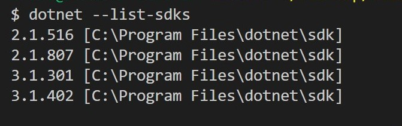
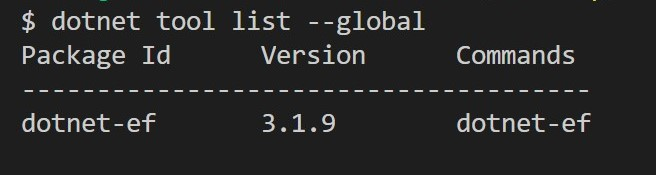
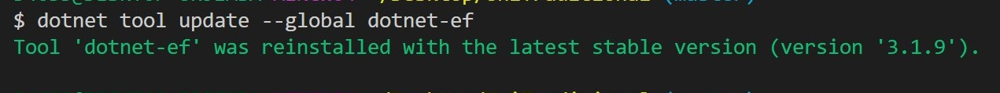
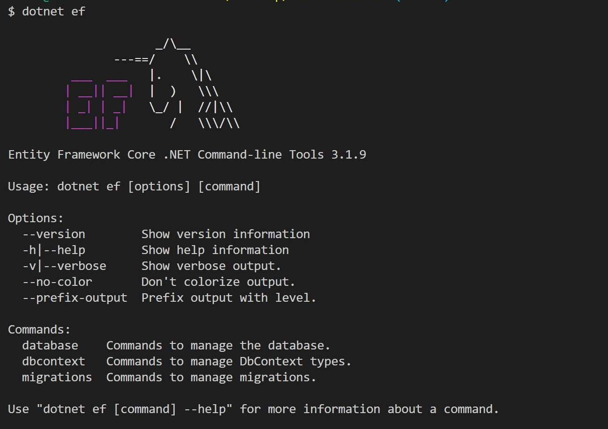
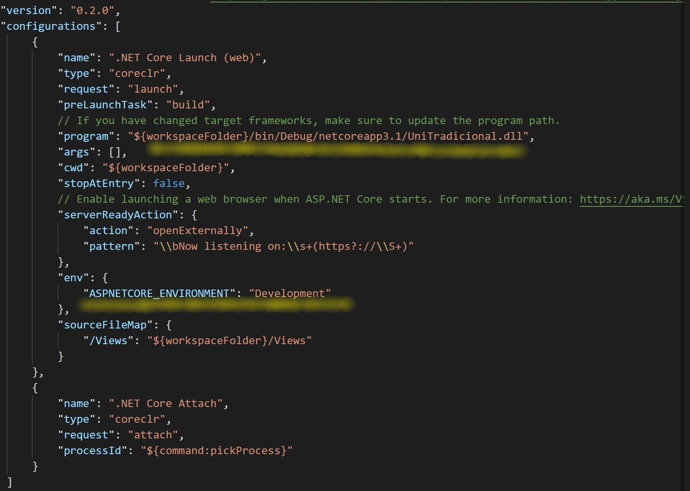
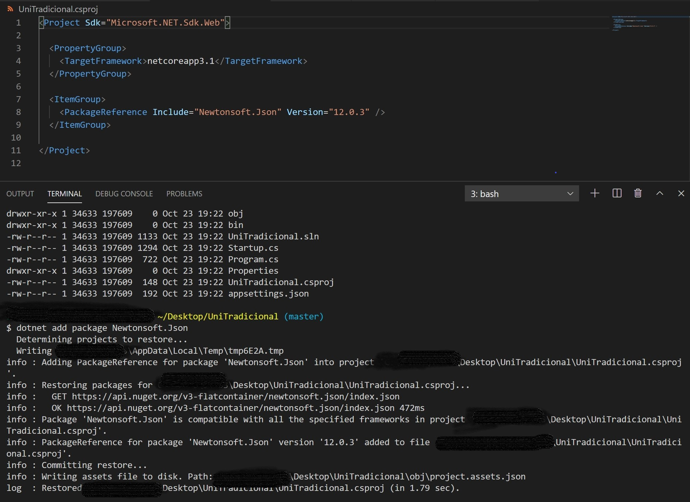
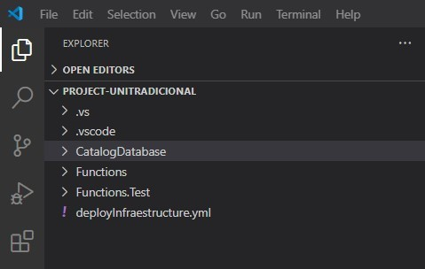

# Tema 2: Desarrollo basado en pruebas

## Ejercicio 1: Instalar alguno de los entornos virtuales de node.js (o de cualquier otro lenguaje con el que se esté familiarizado) y, con ellos, instalar la última versión existente, la versión minor más actual de la 4.x y lo mismo para la 0.11 o alguna impar (de desarrollo).

Al emplear .Net Core 3.1 SDK (Software Development Kit) en la realización de mi proyecto, no necesito instalar un entorno virtual. Sin embargo, si explicaré algunos detalles que tuve en cuenta para el manejo de las herramientas empleadas por este framework.
.Net Core SDK me permite desarrollar APIs Web, interfaces de usuario y otras aplicaciones basadas en la nube. Incluye un paquete especial de NuGet, mecanismo compatible con Microsoft para compartir código, que define cómo se crean, alojan y consumen los paquetes para .NET, y proporciona las herramientas para cada uno de esos roles, además, contiene una aplicación de consola.

Características:
- .Net es gratis. No hay tarifas ni costos de licencia, incluso para uso comercial.
- .Net es de código abierto y multiplataforma, con herramientas de desarrollo gratuitas para Windows, Linux, macOS.
- .NET es compatible con Microsoft. Microsoft envía versiones oficiales que se crean y prueban en servidores mantenidos por Microsoft en Azure y son compatibles como cualquier producto de Microsoft.

Entonces, Para probar que se encuentra instalado, ingresando el comando:



Instalando las herramientas:

``` $ dotnet ef ``` 
(Entity Framework) Core Puede ser instalada como una herramienta global o local. En este caso fue instalada como una herramienta global.



Actualizar las herramientas globales a la última versión



Instalar una versión específica agregando al siguiente comando

``` $ --version <VERSION>  ``` Ejecutar el siguiente comando para verificar que EF Core CLI tools fue instalada correctamente:



La ubicación predeterminada de los archivos binarios de las herramientas instaladas depende del sistema operativo:

```
OS -Linux/macOS   Path-$HOME/.dotnet/tools
OS -Windows          Path-%USERPROFILE%\.dotnet\tools

```
Usar múltiples entornos en ASP.NET Core
ASP.NET Core configura el comportamiento de la aplicación según el entorno de ejecución mediante una variable de entorno.



Para determinar el entorno de ejecución, ASP.NET Core lee las siguientes variables de entorno:
- DOTNET_ENVIRONMENT
- ASPNETCORE_ENVIRONMENT cuando se llama a ConfigureWebHostDefaults. Las plantillas de aplicación web ASP.NET Core predeterminadas llaman a ConfigureWebHostDefaults. El valor ASPNETCORE_ENVIRONMENT anula DOTNET_ENVIRONMENT.

IHostEnvironment.EnvironmentName se puede establecer en cualquier valor, pero el framework proporciona los siguientes valores:
- Development: el archivo launchSettings.json establece ASPNETCORE_ENVIRONMENT en Desarrollo en la máquina local.
- Staging
- Production : el valor predeterminado si no se han establecido DOTNET_ENVIRONMENT y ASPNETCORE_ENVIRONMENT


[Enlace](https://docs.microsoft.com/en-us/ef/core/miscellaneous/cli/dotnet): Referencia Documentación de Microsoft Empleada

[Enlace](https://docs.microsoft.com/es-es/aspnet/core/fundamentals/environments?view=aspnetcore-3.1): Referencia Documentación de Microsoft Empleada


## Ejercicio 2: Crear una descripción del módulo usando package.json. En caso de que se trate de otro lenguaje, usar el método correspondiente.

NuGet es un administrador de paquetes para el ecosistema .NET y es la principal forma en que se pueden descubrir y adquirir bibliotecas de código abierto .NET. NuGet.org, un servicio gratuito proporcionado por Microsoft para alojar paquetes NuGet, es el host principal para los paquetes NuGet públicos, pero puede publicar en servicios NuGet personalizados como MyGet y Azure Artifacts.

La forma principal de agregar dependencias a una biblioteca .NET es hacer referencia a paquetes NuGet. Es importante administrar correctamente las dependencias para evitar que los cambios en otras bibliotecas .NET rompan su biblioteca .NET, ¡y viceversa!

El comando dotnet add package proporciona una opción conveniente para agregar una referencia de paquete a un archivo de proyecto. Después de ejecutar el comando, hay una verificación de compatibilidad para garantizar que el paquete sea compatible con los marcos del proyecto. Si la verificación pasa, se agrega un elemento <PackageReference> al archivo del proyecto y se ejecuta la restauración de dotnet.



[Enlace](https://docs.microsoft.com/es-es/dotnet/standard/library-guidance/nuget): Referencia Documentación de Microsoft Empleada

## Ejercicio 3: Descargar el repositorio de ejemplo anterior, instalar las herramientas necesarias (principalmente Scala y sbt) y ejecutar el ejemplo desde sbt. Alternativamente, buscar otros marcos para REST en Scala tales como Finatra o Scalatra y probar los ejemplos que se incluyan en el repositorio.

## Ejercicio 4: Para la aplicación que se está haciendo, escribir una serie de aserciones y probar que efectivamente no fallan. Añadir tests para una nueva funcionalidad, probar que falla y escribir el código para que no lo haga. A continuación, ejecutarlos desde mocha (u otro módulo de test de alto nivel), usando descripciones del test y del grupo de test de forma correcta. Si hasta ahora no has subido el código que has venido realizando a GitHub, es el momento de hacerlo, porque lo vamos a necesitar un poco más adelante.

Como objetivo, quiero construir una solución que contenga un proyecto de prueba unitaria al proyecto de código fuente que se definí para cada microservicio.
Para el microservicio Catálogo de Eventos la solución completa tiene la siguiente estructura de directorios:



Comandos ejecutados:

```
$ dotnet new sln -o unit-testing-using-dotnet-test

```
Dentro del directorio a la carpeta unit-testing-using-dotnet-test

```
$ dotnet new classlib -o CatalogoService

```

El comando dotnet new classlib crea un nuevo proyecto de biblioteca de clases en la carpeta CatalogoService. La nueva biblioteca de clases contendrá el código que se probará.
En el directorio unit-testing-using-dotnet-test, ejecute el siguiente comando para agregar el proyecto de biblioteca de clases a la solución:

```
$ dotnet sln add ./CatalogoService/CatalogoService.csproj

```

Create the CatalogoService.Tests project by running the following command:

```
$ dotnet new xunit -o CatalogoService.Tests

```
Agregue el proyecto de prueba al archivo de la solución ejecutando el siguiente comando:

```
$ dotnet sln add ./CatalogoService.Tests/CatalogoService.Tests.csproj

```

Adicionar al CatalogoService class library as a dependency del CatalogoService.Tests project:

```
$ dotnet add ./CatalogoService.Tests/CatalogoService.Tests.csproj reference ./CatalogoService /CatalogoService.csproj

```
Crear el Test

- Empleando el enfoque (TDD), es escribir una prueba antes de implementar el código de destino.Mi objetivo es escribir  un prueba para la opción de filtro de categoría(niño, muejr, hombre) en el catálogo de eventos para posteriormente selecionar el combo a comprar según la categoría filtrad. Entonces, el método IsCategory es invocable, pero no implementado. Una llamada de prueba a IsCategory falla. Con TDD, se escribe una prueba que se sabe que falla. El código de destino se actualiza para aprobar la prueba. Continuaré repitiendo este enfoque, escribiendo una prueba fallida y luego actualizando el código de destino para aprobar.

[Enlace](https://docs.microsoft.com/es-es/dotnet/core/testing/unit-testing-best-practices): Referencia Documentación de Microsoft Empleada

## Ejercicio 5: Ejercicio: Haced los dos primeros pasos antes de pasar al tercero.

